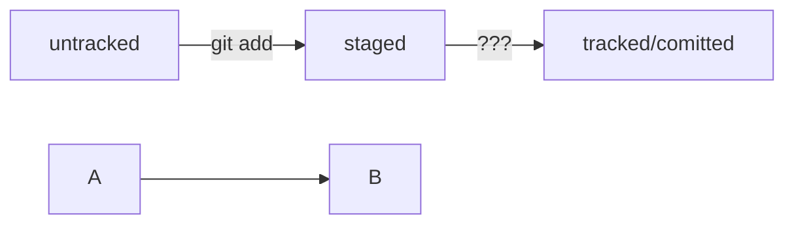

# BASH tips 

cd – сменить директорию 
&emsp; ~ домашняя директория 
&emsp; .. на уровень выше 
&emsp;. текущая директория (когда нужно запустить скрипт и передать папку в качестве параметра) 

pwd – показать путь текущей директории 
ls – показать файлы текущей директории 
&emsp; -la в виде списка 
&emsp; -а – все, включая скрытые (начинаются с .) 

touch – создать файл 
mkdir – создать директорию 
&emsp; -p создать структуру директорий 

cp – копирование файлов 
mv – перемещение файлов и папок 
cat – чтение файлов 
rm, rmdir, rm - r – удаление файлов и папок 
&emsp; && – несколько команд 

git config – конфигурация git 
&emsp; git config --global user.name "User Namovich" # имя или ник нужно написать латиницей и в  кавычках 

git init – создание репозитория в папке 
rm -rf .git - разгитить 
&emsp; ключ -r (от англ. recursive — «рекурсивно») позволяет удалять папки вместе с их содержимым; 
&emsp; ключ -f (от англ. force — «заставить») избавит вас от вопросов вроде «Вы точно хотите удалить этот файл? А этот? И этот тоже?». 

git status – проверить состояние репозитория 
git add – подготовить файлы к сохранени. Пример git add --all (добавить все файлы) git add . (добавить всю текущую папку) 
git commit – выполнить коммит 
&emsp; -m – добавить сообщение (комментарий) 

clip < ~/.ssh/id_ed25519.pub – скопировать содержимое файла с ключом в буфер 
git log – история коммитов 
&emsp; --oneline - сокращенный лог
git config --global user.email username@yandex.ru # здесь нужно указать свой настоящий email 
ssh-keygen -t ed25519 -C "электронная почта, к которой привязан ваш аккаунт на GitHub" – создать ключ 
git remote add – привязать удаленный репозиторий к локальному 
git remote add origin git@github.com:%ИМЯ_АККАУНТА%/first-project.git 
&emsp; Где origin – имя удаленного репозитория 

git remote –v – убедиться, что репозитории связаны 
git push -u origin main – первый пуш. Где origin имя удаленного репозитория, а main (master) – название текущей ветки. -u связывает удаленную ветку и локальную 
&emsp; --force - принудительный пуш, если обновляемая ветка в репозитории старше, чем в локальном (например, был откат коммита)

git commit --amend --no-edit  - обновить/исправить последний коммит (внести изменения без добавления нового коммита) 
git commit --amend -m - изменить сообщение коммита 
git restore --staged <file> - выполнить unstage изменений (до коммита) 
git reset --hard <commit hash> - откат к указанному коммиту 
git restore <file> - откатить изменения, которые не попали ни в staging, ни в коммит (если случайно отредактирован файл и теперь попал в modified) 
git diff - посмотреть какие изменения были сделаны в коммите 
&emsp; staged - посмотреть изменения в staged (после add) 
.gitignore - файл, в котором можно перечислить файлы, которые не должны трекаться, например: 

&emsp;.DS_Store 

&emsp; # игнорировать все файлы, которые заканчиваются на .jpeg 
&emsp; *.jpeg 

&emsp; # игнорировать все файлы "tmp" во всех подпапках папки docs 
&emsp; docs/*/tmp 

&emsp; # игнорировать файлы file0.txt, file1.txt и file2.txt 
&emsp; # при этом не игнорировать file3.txt, file4.txt, ... 
&emsp; file[0-2].txt  

&emsp; file?.txt - будут проигнорированы, например, файлы fileA.txt и file1.txt. А вот файл file12.txt не будет проигнорирован, потому что в его названии два символа после file, а не один. 

&emsp; # игнорировать todo.txt в корне репозитория 
&emsp; /todo.txt 

&emsp; # для сравнения: spam.txt будет игнорироваться во всех папках 
&emsp; spam.txt 

&emsp; # игнорировать папку build 
&emsp; build/  

&emsp; # игнорировать файлы "docs/current/tmp", "docs/old/tmp", 
&emsp; # а также "docs/old/saved/a/b/c/d/tmp" 
&emsp; # и даже "docs/tmp", потому что ноль вложенных папок тоже подходит 
&emsp; docs/**/tmp 

&emsp; # игнорировать только "docs/current/tmp" и "docs/old/tmp" 
&emsp; # файл "docs/old/saved/a/b/c/d/tmp" не попадает в правило 
&emsp; docs/*/tmp  

&emsp; # игнорировать все JPEG-файлы 
&emsp; *.jpeg 

&emsp; # но только не мем с Doge 
&emsp; !doge.jpeg  

&emsp; !# игнорировать все файлы в каталоге build 
&emsp; !build/ 

&emsp; !# игнорировать все .log файлы 
&emsp; !*.log 
 
&emsp; !# не игнорировать *.log файлы в examples 
&emsp; !# потому что это пример для документации 
&emsp; !!examples/**/*.log  

git status --ignored - отобразить игнорируемые файлы 

Пример mermaid-схемы: 

test

