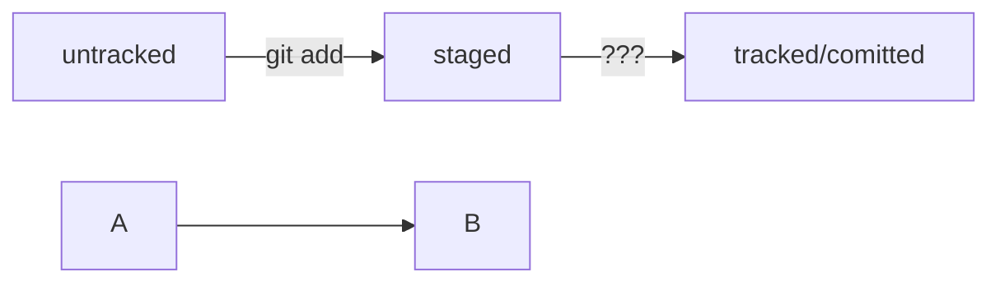

# BASH tips 

cd – сменить директорию 
&emsp; ~ домашняя директория 
&emsp; .. на уровень выше 
&emsp;. текущая директория (когда нужно запустить скрипт и передать папку в качестве параметра) 

pwd – показать путь текущей директории 
ls – показать файлы текущей директории 
&emsp; -la в виде списка 
&emsp; -а – все, включая скрытые (начинаются с .) 

touch – создать файл 
mkdir – создать директорию 
&emsp; -p создать структуру директорий 

cp – копирование файлов 
mv – перемещение файлов и папок 
cat – чтение файлов 
rm, rmdir, rm - r – удаление файлов и папок 
&emsp; && – несколько команд 

git config – конфигурация git 
&emsp; git config --global user.name "User Namovich" # имя или ник нужно написать латиницей и в  кавычках 

git init – создание репозитория в папке 
rm -rf .git - разгитить 
&emsp; ключ -r (от англ. recursive — «рекурсивно») позволяет удалять папки вместе с их содержимым; 
&emsp; ключ -f (от англ. force — «заставить») избавит вас от вопросов вроде «Вы точно хотите удалить этот файл? А этот? И этот тоже?». 

git status – проверить состояние репозитория 
git add – подготовить файлы к сохранени. Пример git add --all (добавить все файлы) git add . (добавить всю текущую папку) 
git commit – выполнить коммит 
&emsp; -m – добавить сообщение (комментарий) 

clip < ~/.ssh/id_ed25519.pub – скопировать содержимое файла с ключом в буфер 
git log – история коммитов 
&emsp; --oneline - сокращенный лог
git config --global user.email username@yandex.ru # здесь нужно указать свой настоящий email 
ssh-keygen -t ed25519 -C "электронная почта, к которой привязан ваш аккаунт на GitHub" – создать ключ 
git remote add – привязать удаленный репозиторий к локальному 
git remote add origin git@github.com:%ИМЯ_АККАУНТА%/first-project.git 
&emsp; Где origin – имя удаленного репозитория 

git remote –v – убедиться, что репозитории связаны 
git push -u origin main – первый пуш. Где origin имя удаленного репозитория, а main (master) – название текущей ветки. -u связывает удаленную ветку и локальную 
git commit --amend --no-edit  - обновить/исправить последний коммит (внести изменения без добавления нового коммита) 
git commit --amend -m - изменить сообщение коммита 
git restore --staged <file> - выполнить unstage изменений

Пример mermaid-схемы: 

